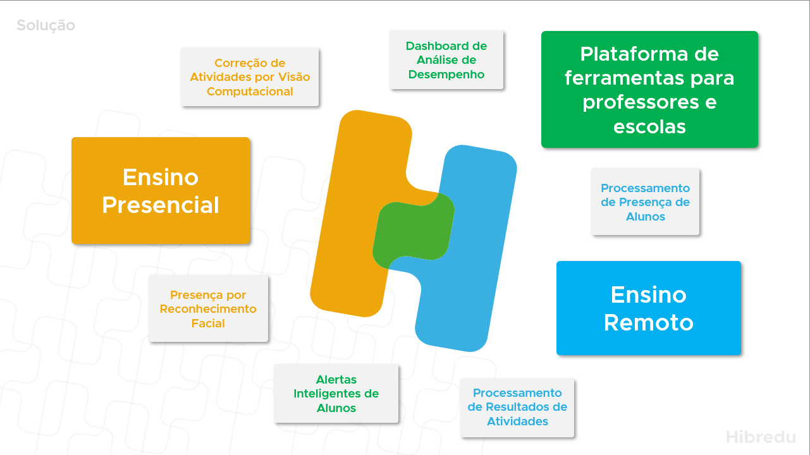
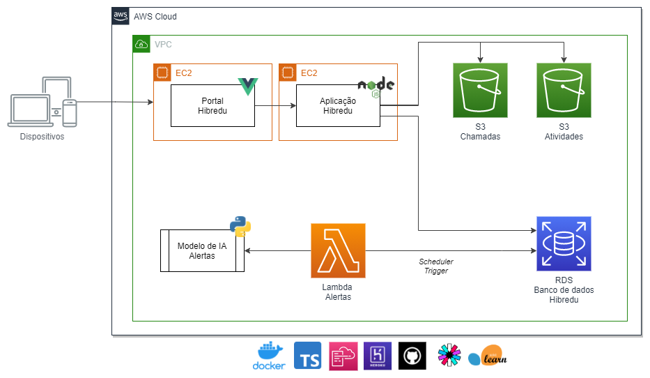

# Hibredu - Docs

O projeto Hibredu foi desenvolvido como trabalho de conclusão da Faculdade de Informática e Administração Paulista (FIAP). Nele os alunos proporam uma plataforma que auxiliasse os professores em seu dia a dia de trabalho. Com o objetivo de unir o Ensino Presencial + Ensino Remote + Plataforma de ferramentas para professores e escola. 

Como principais funcionalides estão elas:

- Ensino Presencial
    - Correção de atividades utilizando visão computacional 
    - Presença por reconhecimento facial
- Plataforma de ferramentas para professores e escolas
    - Dashboard de análise de desempenho
    - Alertas inteligêntes de alunos
- Ensino Remoto
    - Processamento de presença de alunos
    - Processamento de resultado de atividades

## Monografia

Documento em PDF do projeto: [Hibredu_-_Monografia_Startup_One.pdf](Hibredu_-_Monografia_Startup_One.pdf)

Vídeo Pitch: https://youtu.be/tGTKKMCS8V0

## Aplicações

Para o projeto foi desenvolvida uma arquitetura de sistemas completa com diversas aplicações formando uma solução para os professores.

**Plataforma Web**

Repositório: https://github.com/hibredu/hibredu-web

**API Backend**

Repositório: https://github.com/hibredu/hibredu-app

## Desenho arquitetura

## Equipe

- [Felipe Toscano da Silva](https://www.linkedin.com/in/felipetoscanosilva/)
- [Gabriel Siqueira Petillo](https://www.linkedin.com/in/gabrielpetillo/)
- [Giovanna Marinho Pereira de Godoy](https://www.linkedin.com/in/giovanna-godoy/)
- [Jean Jacques Nascimento Barros](https://www.linkedin.com/in/jjean-jacques10/)
- [Vinicius Mota Pereira Silva](https://www.linkedin.com/in/vinicius-mota-pereira-silva/)